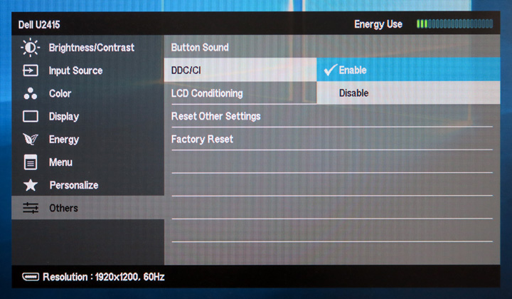

# Monitorian

Monitorian is a Windows desktop tool to adjust the brightness of multiple monitors with ease.

 
(DPI: 200%)

## Requirements

 * Windows 7 or newer
 * .NET Framework 4.6.2
 * An external monitor must be DDC/CI enabled.

## Download

 * Windows 10 Anniversary Update (1607) or newer: 
[Monitorian](https://www.microsoft.com/store/apps/9nw33j738bl0) (Windows Store)

 * Other: 
:floppy_disk: [Installer](https://github.com/emoacht/Monitorian/releases/download/1.7.4-Installer/MonitorianInstaller174.zip) | :floppy_disk: [Executables](https://github.com/emoacht/Monitorian/releases/download/1.7.4-Executables/Monitorian174.zip)

## Install/Uninstall

When you use only executables, please note the following:

 - The settings file will be created at: `[system drive]\Users\[user name]\AppData\Local\Monitorian\`
 - When you check [Start on sign in], a registry value will be added to: `HKEY_CURRENT_USER\Software\Microsoft\Windows\CurrentVersion\Run`

## Remarks

 - To rename the monitor in this app, press and hold its name until it turns to be editable.
 - The number of monitors shown at a time is currently up to 4.

## Development

This app is a WPF app developed and tested with Surface Pro 4.

To know the capabilities of monitors, click the app title in menu window 3 times and then hit the appeared button. It will create a log file on the desktop.

## History

Ver 1.7.4 2018-11-14

 - Suppress an exception

Ver 1.7.2 2018-10-17

 - Fix an exception

Ver 1.7.1 2018-10-8

 - Modify handling of exceptions

Ver 1.7.0 2018-8-22

 - Improved finding monitor name for Windows 10 April 2018 Update (1803)

Ver 1.6.0 2018-5-25

 - Extended function to control DDC/CI connected monitor
 - Modified function to enable moving together

Ver 1.5.1 2018-2-19

 - Refactored

Ver 1.5.0 2018-2-12

 - Improved handling of uncontrollable monitor

Ver 1.4.0 2018-1-17

 - Modified handling of monitor names

Ver 1.2.4 2017-10-12

 - Added control by mouse wheel

Ver 1.2.3 2017-5-24

 - Suppressed exception

Ver 1.2.2 2017-4-17

 - Fixed issue of window location

Ver 1.2.1 2017-4-3

 - Refactored

Ver 1.2.0 2017-3-29

 - Added function to show adjusted brightness

Ver 1.0.0 2017-2-22

 - Initial release

## License

 - MIT License

## Developer

 - emoacht (emotom[atmark]pobox.com)
