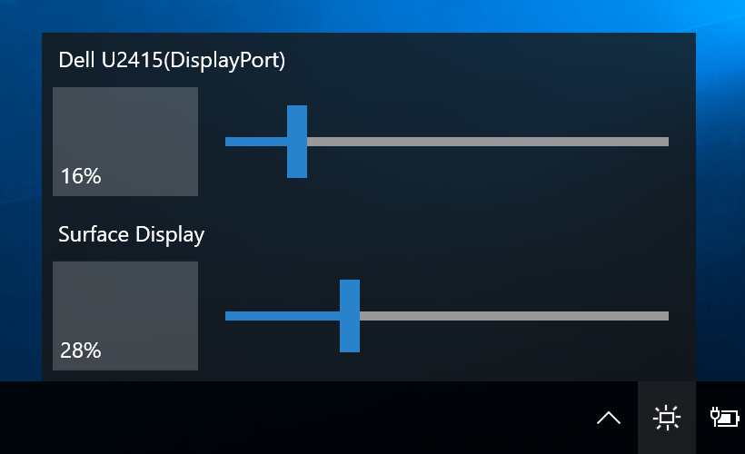

Monitorian
==========

Monitorian is a Windows desktop app to adjust the brightness of multiple monitors at ease.

 
(DPI: 200%)

##Requirements

 * Windows 7 or newer
 * .NET Framework 4.6.2
editable.
##Download

:floppy_disk: [Download executables](https://github.com/emoacht/Monitorian/releases/download/0.9.5/Monitorian095.zip)

##Remarks

 - An external monitor must be DDC/CI enabled.
 - The number of monitors shown at a time is currently up to 4.
 - To change the monitor name in this app, press and hold the name until it turns to be editable.

##Development

This app is a WPF app developed and tested with Surface Pro 4.

##Author

 - emoacht (emotom[atmark]pobox.com)

##License

 - MIT License
