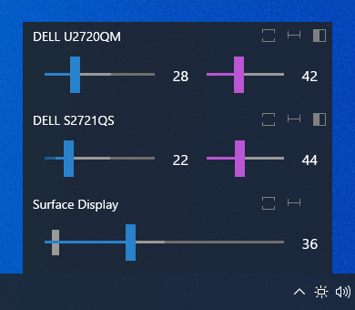

# Monitorian

Monitorian is a Windows desktop tool to adjust the brightness of multiple monitors with ease.

<br>
(DPI: 200%)

The user can change the brightness of monitors, including external ones, either individually or in unison. For the system with an ambient light sensor, the adjusted brightness can be shown along with configured one.

<br>
(DPI: 100%)

In addition, the user can change the adjustable range of brightness and contrast for each monitor seamlessly.

&nbsp;
<br>

https://user-images.githubusercontent.com/7205690/210137118-66cfdd6e-9847-41b3-a836-d1ff8cf73f3d.mp4

Additional languages:

 - Arabic (ar) by @MohammadShughri
 - Catalan (ca) by @ericmp33
 - German (de) by @uDEV2019
 - Spanish (es) by @josemirm and @ericmp33
 - French (fr) by @AlexZeGamer and @Rikiiiiiii
 - Italian (it) by @GhostyJade
 - Japanese (ja-JP) by @emoacht
 - Korean (ko-KR) by @VenusGirl
 - Dutch (nl-NL) by @JordyEGNL
 - Polish (pl-PL) by @Daxxxis and @FakeMichau
 - Portuguese (pt-BR) by @guilhermgonzaga
 - Romanian (ro) by @calini
 - Russian (ru-RU) by @SigmaTel71 and @San4es
 - Turkish (tr-TR) by @webbudesign
 - Ukrainian (uk-UA) by @kaplun07
 - Simplified Chinese (zh-Hans) by @ComMouse, @zhujunsan, @XMuli, @FISHandCHEAP and @FrzMtrsprt
 - Traditional Chinese (zh-Hant) by @toto6038 and @XMuli

## Requirements

 * Windows 7 or newer
 * .NET Framework __4.8__
 * An external monitor must be DDC/CI enabled.


## Download

 * Microsoft Store (Windows 10 (1607) or newer):<br>
   [Monitorian](https://www.microsoft.com/store/apps/9nw33j738bl0)<br>
   <a href='//www.microsoft.com/store/apps/9nw33j738bl0?cid=storebadge&ocid=badge'></a>

 * Winget (a.k.a. [Windows Package Manager](https://docs.microsoft.com/en-us/windows/package-manager), App Installer):
   ```
   winget install Monitorian -s msstore
   ```

 * Other:<br>
:floppy_disk: [Installer](https://github.com/emoacht/Monitorian/releases/download/4.5.0-Installer/MonitorianInstaller450.zip)

## Install/Uninstall

If you wish to place executable files on your own, you can extract them from installer file (.msi) by the following command:

```
msiexec /a [source msi file path] targetdir=[destination folder path (absolute path)] /qn
```

In such case, please note the following:

 - The settings file (and other file) will be created at: `[system drive]\Users\[user name]\AppData\Local\Monitorian\`
 - When you check [Start on sign in], a registry value will be added to: `HKEY_CURRENT_USER\Software\Microsoft\Windows\CurrentVersion\Run`

## Remarks

 - The monitor name shown in main window can be changed to distinguish monitors easily. To change the name, press and hold it until it turns to be editable.
 - To adjust the brightness by a touchpad, place two fingers on it and swipe horizontally. The touchpad must be a precision touchpad.
 - The number of monitors shown at a time is up to 4.
 - In case an external monitor is not shown, read [detection of external monitors](#detection-of-external-monitors).

## Add-on Features

Add-on features are available for Microsoft Store version on a subscription basis.

### Hot keys & Shortcut keys


All hot keys for brightness can be switched to contrast by `To contrast` hot key. It can be switched back to brightness by `To brightness` hot key.

### Command-line options

You can use command-line options to get/set the brightness or contrast.

| Actions                                | Options                                |
|----------------------------------------|----------------------------------------|
| Get brightness of a monitor.           | /get                                   |
| Get brightness of a specified monitor. | /get [Device Instance ID]              |
| Get brightness of all monitors.        | /get all                               |
| Set brightness of a monitor.           | /set [Brightness]                      |
| Set brightness of a specified monitor. | /set [Device Instance ID] [Brightness] |
| Set brightness of all monitors.        | /set all [Brightness]                  |

The device instance ID is an unique identifier given by the OS to each monitor. It must be enclosed in quotes. 

You can switch to contrast by inserting `contrast` after `/get` or `/set` (e.g. `/get contrast all`).

If this app is called with `/get` or `/set`, it will return

```
[Device Instance ID] [Monitor name] [Brightness] B
```

'B' at the end indicates brightness. In addition, '*' will be added in the case of a selected monitor. 

If this app is called with `/get contrast` or `/set contrast`, it will return

```
[Device Instance ID] [Monitor name] [Contrast] C
```

'C' at the end indicates contrast. If contrast is not supported by a monitor, '-' will be shown instead.

The brightness or contrast ranges from 0 to 100%. When you use `/set` option, it can be specified with the number itself (e.g. 20), increase (e.g. +10) or decrease (e.g. -10).

The options can be executed consecutively (e.g. `monitorian /set 20 /set contrast 40`).

You can call this app by its name `Monitorian` in command prompt or bat file. From Task Scheduler, it can be performed by the path to its alias `%LOCALAPPDATA%\Microsoft\WindowsApps\Monitorian.exe`. For example, to increase brightness of all monitors by 30%, the Action will be the following:


The code for add-on features is not included in this repository.

## Detection of external monitors

This app checks if each external monitor is controllable through DDC/CI and shows only controllable ones. 

For this purpose, this app requests a monitor to send its capabilities information through DDC/CI and checks if it includes the capabilities to get/set the brightness. If capabilities information is not received or these capabilities are not included, such monitor will be regarded as not controllable through DDC/CI.

This function has been tested and worked well in most cases. Therefore, if a monitor is not shown, it is most likely caused by hardware-oriented reasons that cannot be solved by this app. Such reasons include:

1. The monitor model does not support DDC/CI.

1. The monitor's DDC/CI setting is OFF. You may need to change the setting by OSD menu.

1. The monitor's DDC/CI function is weird. Some monitors are found not to return correct capabilities information.

1. The PC's connector does not support DDC/CI.

1. The cable, converter, or docking station which connects the PC and the monitor is not compatible with DDC/CI. Thunderbolt/USB-C cables are generally compatible but converters aren't. Surface Dock and Surface Dock 2 are known to be compatible. 

1. The monitor or the PC have issues including contact failure in connector. This is particularly the case for old monitors.

If you think it is worth to report, read [reporting](#reporting) and then create an issue with logs and other relevant information.

## Development

This app is a WPF app developed and tested with Surface Pro series.

### Reporting

The controllability of an external monitor depends on whether the monitor successfully responds to DDC/CI commands. Even if a monitor is expected to be DDC/CI compatible, it may fail to respond typically when the system starts or resumes.

In any case, reporting on the controllability of a monitor MUST include probe.log and operation.log described below. The logs will be the starting point to look into the issue.

### Probe

 - You can check the compatibility of your monitor by __probe.log__. It will include raw information on monitors, including capabilities through DDC/CI, from various APIs that are used to find accessible monitors. To get this log, tap `Probe into monitors` in the hidden menu described below.
 - To open the hidden menu, <ins>click app title at the top of menu window 3 times.</ins> 

### Rescan

 - As part of testing, you can manually trigger to rescan monitors via `Rescan monitors` in the hidden menu. A system sound will be played when completed.

### Operations

 - As part of testing, you can set this app to record operations to scan monitors and reflect their states. To enable the recording, check `Make operation log` in the hidden menu. After some information is recorded, you will be able to copy __operation.log__ by `Copy operation log`.
 - If you notice an issue, <ins>enable the recording and then wait until the issue happens. When you notice the issue again, copy this log and check the information including the change before and after the issue.</ins>

### Command-line arguments

 - As part of testing, you can store persistent arguments in `Command-line arguments` in the hidden menu. They will be tested along with current arguments when this app starts.
 - For example, if you want this app to always use English language (default), set `/lang en` in this box.

### Exceptions

 - If anything unexpected happens, __exception.log__ will be saved. It will be useful source of information when looking into an issue.

### Setup

1. [Install Visual Studio](https://docs.microsoft.com/en-us/visualstudio/install/install-visual-studio).
2. In Visual Studio Installer, go to the **Individual components** tab and make sure the following components are checked and installed. The version must match the corresponding field of project (.csproj) file of each project.

| Components                                                  | Fields                 |
|-------------------------------------------------------------|------------------------|
| .NET Framework 4.8 SDK<br>.NET Framework 4.8 targeting pack | TargetFrameworkVersion |
| Windows 10 SDK (10.0.19041.0)                               | TargetPlatformVersion  |

3. Load the solution by specifying `/Source/Monitorian.sln`. Then go to the solution explorer and right click the solution name and execute `Restore NuGet Packages`.
4. To open installer project, install [WiX Toolset Build Tools](https://wixtoolset.org/releases/) and [WiX Toolset Visual Studio Extension](https://marketplace.visualstudio.com/items?itemName=WixToolset.WiXToolset).

### Globalization

An alternative language can be shown by adding a Resources (.resx) file into `/Source/Monitorian.Core/Properties` folder. Each Resources file stores name/value pairs for a specific language and will be selected automatically depending on the user's environment.

 - The file name must be in `Resources.[language-culture].resx` format.
 - The name of a name/value pair must correspond to that in the default `Resources.resx` file to override it.

### Reference

 - VESA [Monitor Control Command Set (MCCS)](https://www.google.co.jp/search?q=VESA+Monitor+Control+Command+Set+Standard+MCCS) standard

## History

Ver 4.5 2023-9-29

 - Modify behaviors and so on

Ver 4.4 2023-6-20

 - Fix bugs and so on

Ver 4.3 2023-4-21

 - Fix window position on Windows 11 Build 22621

Ver 4.2 2023-3-21

 - Change function to change in unison
 - Supplement French (fr) language. Thanks to @Rikiiiiiii!
 
Ver 4.1 2023-3-13

 - Improve internal code
 - Supplement Ukrainian (uk-UA) language. Thanks to @kaplun07!
 - Supplement Russian (ru-RU) language. Thanks to @San4es!

Ver 4.0 2022-12-31

 - Modify UI
 - Add Ukrainian (uk-UA) language. Thanks to @kaplun07!

Ver 3.15 2022-12-4

 - Fix touchpad swipe
 - Supplement Simplified Chinese (zh-Hans) language. Thanks to @FrzMtrsprt!

Ver 3.14 2022-10-23

 - Make change of monitors arrangement reflected immediately

Ver 3.13 2022-8-29

 - Shorten scan time when multiple external monitors exist
 - Supplement German (de) language. Thanks to @uDEV2019!
 
Ver 3.12 2022-7-4

 - Enable mouse horizontal wheel to change brigtness concurrently (except that in unison)

Ver 3.11 2022-6-2

 - Enable to use accent color for brightness
 - Supplement Korean (ko-KR) language. Thanks to @VenusGirl!
 - Fix error message for unreachable monitor

Ver 3.10 2022-4-12

 - Redesign small slider
 - Add Catalan (ca) language. Thanks to @ericmp33!
 - Supplement Spanish (es) language. Thanks to @ericmp33!
 - Improve Simplified Chinese (zh-Hans) language. Thanks to @FISHandCHEAP!
 - Supplement Traditional Chinese (zh-Hant) language. Thanks to @XMuli!

Ver 3.9 2022-1-20

 - Add Portuguese (pt-BR) language. Thanks to @guilhermgonzaga!
 - Supplement Simplified Chinese (zh-Hans) language. Thanks to @XMuli!
 - Fix Dutch (nl-NL) language. Thanks to @JordyEGNL!

Ver 3.8 2021-12-18

 - Add Romanian (ro) language. Thanks to @calini!

Ver 3.7 2021-12-3

 - Fix issue of combination of moving in unison and deferring change
 - Modify DPI awareness of the icon

Ver 3.6 2021-9-30

 - Fix count for scan process
 - Add Italian (it) language. Thanks to @GhostyJade!

Ver 3.5 2021-9-9

 - Make rounded corners default on Windows 11
 - Add Traditional Chinese (zh-Hant) language. Thanks to @toto6038!

Ver 3.4 2021-8-30

 - Add Dutch (nl-NL) language. Thanks to @JordyEGNL!
 - Supplement Simplified Chinese (zh-Hans) language. Thanks to @zhujunsan!

Ver 3.3 2021-8-20

 - Add Arabic (ar) language. Thanks to @MohammadShughri!

Ver 3.2 2021-8-9

 - Supplement German (de) language. Thanks to @uDEV2019!

Ver 3.1 2021-8-4

 - Supplement Polish (pl-PL) language. Thanks to @FakeMichau!
 - Add Turkish (tr-TR) language. Thanks to @webbudesign!
 - Supplement Russian (ru-RU) language. Thanks to @SigmaTel71!
 - Add Spanish (es) language. Thanks to @josemirm!

Ver 3.0 2021-7-1

 - Change UI

Ver 2.19 2021-6-16

 - Enable to adjust brightness by precision touchpad

Ver 2.18 2021-5-23

 - Add German (de) language. Thanks to @uDEV2019!

Ver 2.17 2021-5-19

 - Add French (fr) language. Thanks to @AlexZeGamer!

Ver 2.16 2021-4-11

 - Add Korean (ko-KR) language. Thanks to @VenusGirl!

Ver 2.14 2021-3-26

 - Improve internal processes

Ver 2.13 2021-2-13

 - Improve internal process

Ver 2.11 2021-1-26

 - Add Russian (ru-RU) language. Thanks to @SigmaTel71!
 - Add Polish (pl-PL) language. Thanks to @Daxxxis!
 - Add Simplified Chinese (zh-Hans) language. Thanks to @ComMouse!

Ver 2.9 2020-12-22

 - Improve codes

Ver 2.8 2020-11-23

 - Adjust mouse wheel roll

Ver 2.7 2020-10-30

 - Enable to change adjustable range
 - Adjust scan process
 - Add get/set brightness test to probe

Ver 2.6 2020-8-10

 - Enable to defer update of brightness

Ver 2.5 2020-8-1

 - Fix issue on empty description

Ver 2.4 2019-12-30

 - Improve scan process

Ver 2.3 2019-11-28

 - Change scan process

Ver 2.2 2019-11-18

 - Change setting to show adjusted brightness by ambient light enabled as default
 - Fix bugs

Ver 2.1 2019-11-6

 - Change location to show when the icon is in overflow area
 - Change behavior when sliders are moving in unison
 - Fix bugs

Ver 2.0 2019-8-6

 - Enable operation by arrow keys
 - Redesign slider

Ver 1.12 2019-3-9

 - Modify to handle raw brightnesses correctly when raw minimum and maximum brightnesses are not standard values. Thanks to @reflecat!
 - Change target framework to .NET Framework 4.7.2

Ver 1.11 2019-2-7

 - Further suppress an exception

Ver 1.10 2019-2-3

 - Change to enable transparency and blur effects only when transparency effects of OS is on

Ver 1.9 2018-12-5

 - Change scan timings after resume

Ver 1.8 2018-11-24

 - Supplement generic monitor name with connection type

Ver 1.7 2018-8-22

 - Improved finding monitor name for Windows 10 April 2018 Update (1803)

Ver 1.6 2018-5-25

 - Extended function to control DDC/CI connected monitor
 - Modified function to enable moving together

Ver 1.5 2018-2-12

 - Improved handling of uncontrollable monitor

Ver 1.4 2018-1-17

 - Modified handling of monitor names

Ver 1.2 2017-10-12

 - Added control by mouse wheel
 - Added function to show adjusted brightness

Ver 1.0 2017-2-22

 - Initial release

## License

 - MIT License

## Libraries

 - [XamlBehaviors for WPF](https://github.com/microsoft/XamlBehaviorsWpf)

## Developer

 - emoacht (emotom[atmark]pobox.com)
