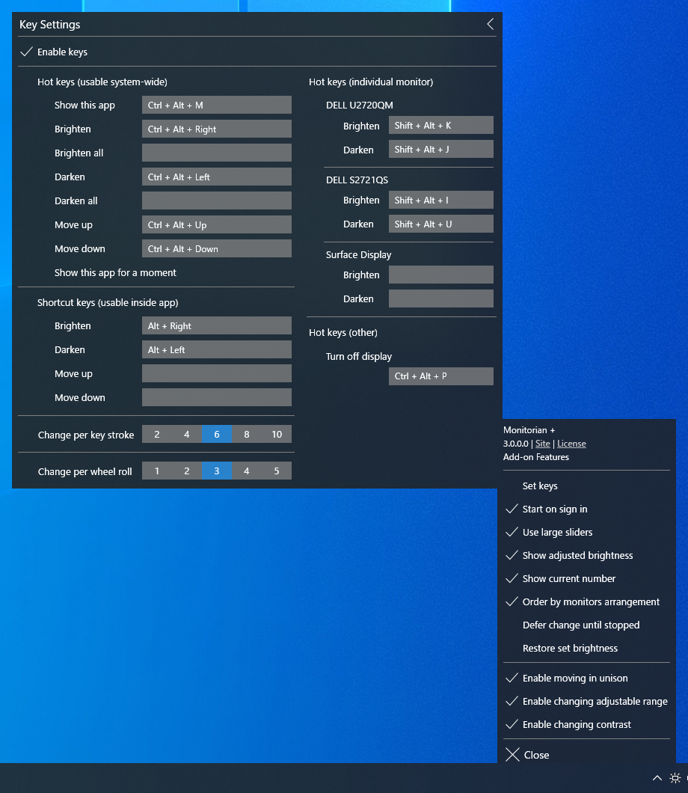

# Monitorian

Monitorian is a Windows desktop tool to adjust the brightness of multiple monitors with ease.

 
(DPI: 200%)

The user can change the brightness of monitors, including external ones, either individually or in unison. For the system with an ambient light sensor, the adjusted brightness can be shown along with configured one.

 
(DPI: 100%)

## Requirements

 * Windows 7 or newer
 * .NET Framework __4.7.2__
 * An external monitor must be DDC/CI enabled.

## Download

 * Windows 10 Anniversary Update (1607) or newer: 
[Monitorian](https://www.microsoft.com/store/apps/9nw33j738bl0) (Windows Store)

 * Other: 
:floppy_disk: [Installer](https://github.com/emoacht/Monitorian/releases/download/2.0.0-Installer/MonitorianInstaller200.zip) | :floppy_disk: [Executables](https://github.com/emoacht/Monitorian/releases/download/2.0.0-Executables/Monitorian200.zip)

## Install/Uninstall

When you use only executables, please note the following:

 - The settings file will be created at: `[system drive]\Users\[user name]\AppData\Local\Monitorian\`
 - When you check [Start on sign in], a registry value will be added to: `HKEY_CURRENT_USER\Software\Microsoft\Windows\CurrentVersion\Run`

## Remarks

 - The monitor name shown in main window can be changed for easier identification of monitors. To change the name, press and hold it until it turns to be editable.
 - The number of monitors shown at a time is up to 4.

## Add-on Features

Add-on features are available for Microsoft Store version on a subscription basis.

The code for add-on features is not included in this repository.

## Development

This app is a WPF app developed and tested with Surface Pro 4.

The log will be an useful source to look into an issue.

 - __exception.log__ - Information on exceptions when an unexpected problem happened.

 - __probe.log__ - Information on capabilities of each monitor obtained from various APIs and used to find accessible monitors. To get this log, click the app title in menu window 3 times and then tap the button appeared beneath.

## History

Ver 2.0.0 2019-8-6

 - Enable operation by arrow keys
 - Redesign slider

Ver 1.12.0 2019-3-9

 - Modify to handle raw brightnesses correctly when raw minimum and maximum brightnesses are not standard values. Thanks to @reflecat!
 - Change target framework to .NET Framework 4.7.2

Ver 1.11.0 2019-2-7

 - Further suppress an exception

Ver 1.10.0 2019-2-3

 - Change to enable transparency and blur effects only when transparency effects of OS is on

Ver 1.9.0 2018-12-5

 - Change scan timings after resume

Ver 1.8.0 2018-11-24

 - Supplement generic monitor name with connection type

Ver 1.7.4 2018-11-14

 - Suppress an exception

Ver 1.7.2 2018-10-17

 - Fix an exception

Ver 1.7.1 2018-10-8

 - Modify handling of exceptions

Ver 1.7.0 2018-8-22

 - Improved finding monitor name for Windows 10 April 2018 Update (1803)

Ver 1.6.0 2018-5-25

 - Extended function to control DDC/CI connected monitor
 - Modified function to enable moving together

Ver 1.5.1 2018-2-19

 - Refactored

Ver 1.5.0 2018-2-12

 - Improved handling of uncontrollable monitor

Ver 1.4.0 2018-1-17

 - Modified handling of monitor names

Ver 1.2.4 2017-10-12

 - Added control by mouse wheel

Ver 1.2.3 2017-5-24

 - Suppressed exception

Ver 1.2.2 2017-4-17

 - Fixed issue of window location

Ver 1.2.1 2017-4-3

 - Refactored

Ver 1.2.0 2017-3-29

 - Added function to show adjusted brightness

Ver 1.0.0 2017-2-22

 - Initial release

## License

 - MIT License

## Developer

 - emoacht (emotom[atmark]pobox.com)
