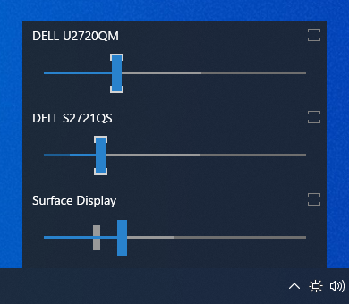
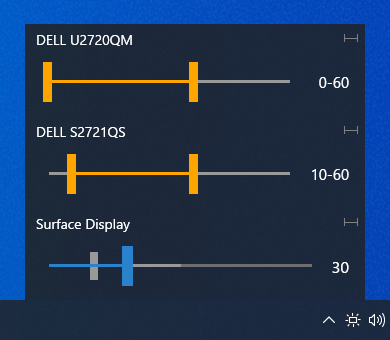

# Monitorian

Monitorian is a Windows desktop tool to adjust the brightness of multiple monitors with ease.

<br>
(DPI: 200%)

The user can change the brightness of monitors, including external ones, either individually or in unison. For the system with an ambient light sensor, the adjusted brightness can be shown along with configured one.

<br>
(DPI: 100%)

In addition, the user can change the adjustable range of brightness for each monitor seamlessly.

<br>
(DPI: 100%)

Additional languages:

- ja-JP (Japanese) by @emoacht
- ko-KR (Korean) by @VenusGirl
- pl-PL (Polish) by @Daxxxis
- ru-RU (Russian) by @SigmaTel71
- zh-Hans (Simplified Chinese) by @ComMouse

## Requirements

 * Windows 7 or newer
 * .NET Framework __4.7.2__
 * An external monitor must be DDC/CI enabled.


## Download

 * Windows 10 Anniversary Update (1607) or newer:<br>
[Monitorian](https://www.microsoft.com/store/apps/9nw33j738bl0) (Microsoft Store)

 * Other:<br>
:floppy_disk: [Installer](https://github.com/emoacht/Monitorian/releases/download/2.16.0-Installer/MonitorianInstaller2160.zip)

## Install/Uninstall

If you wish to place executable files on your own, you can extract them from installer file (.msi) by the following command:

```
msiexec /a [source msi file path] targetdir=[destination folder path (absolute path)] /qn
```

In such case, please note the following:

 - The settings file will be created at: `[system drive]\Users\[user name]\AppData\Local\Monitorian\`
 - When you check [Start on sign in], a registry value will be added to: `HKEY_CURRENT_USER\Software\Microsoft\Windows\CurrentVersion\Run`

## Remarks

 - The monitor name shown in main window can be changed for easier identification of monitors. To change the name, press and hold it until it turns to be editable.
 - The number of monitors shown at a time is up to 4.

## Add-on Features

Add-on features are available for Microsoft Store version on a subscription basis.

### Hot keys & Shortcut keys


### Command-line options

You can use command-line options to get/set the brigtness.

| Actions                                | Options                                |
|----------------------------------------|----------------------------------------|
| Get brightness of a monitor.           | /get                                   |
| Get brightness of a specified monitor. | /get [Device Instance ID]              |
| Get brightness of all monitors.        | /get all                               |
| Set brightness of a monitor.           | /set [Brightness]                      |
| Set brightness of a specified monitor. | /set [Device Instance ID] [Brightness] |
| Set brightness of all monitors.        | /set all [Brightness]                  |

If this app is called with `/get` option, it will return [Device Instance ID] [Monitor name] [Brightness]. The device instance ID is an unique identifier given by the OS to each monitor. The brightness ranges from 0 to 100%. It can be specified with brightness itself (e.g. 20), increase (e.g. +10) or decrease (e.g. -10) when you use `/set` option.

You can call this app by its name `Monitorian` in command prompt or bat file. From Task Scheduler, it can be performed by the path to its alias `%LOCALAPPDATA%\Microsoft\WindowsApps\Monitorian.exe`. For example, to increase brightness of all monitors by 30%, the Action will be the following:


The code for add-on features is not included in this repository.

## Development

This app is a WPF app developed and tested with Surface Pro 4.

### Reporting

The controllability of an external monitor depends on whether the monitor successfully responds to DDC/CI commands. Even if a monitor is expected to be DDC/CI compatible, it may fail to respond (a) if the monitor is weird, (b) if its connection to the system is problematic, or (c) when the system starts or resumes. If an issue is case (a) or (b), this app cannot help it. If case (c), this app may be able to handle it.

In any case, reporting on the controllability of a monitor MUST include probe.log and operation.log described below. The logs will be the starting point to look into the issue.

### Probe

 - You can check the compatibility of your monitor by __probe.log__. It will include raw information on monitors, including capabilities through DDC/CI, from various APIs that are used to find accessible monitors. To get this log, tap `Probe into monitors` in the hidden menu described below.
 - To open the hidden menu, <ins>click app title at the top of menu window 3 times.</ins> 

### Rescan

 - As part of testing, you can manually trigger to rescan monitors via `Rescan monitors` in the hidden menu. A system sound will be played when completed.

### Operations

 - As part of testing, you can record operations to scan monitors and reflect their states. To enable the recording, check `Make operation log` in the hidden menu. After that, __operation.log__ can be copied by `Copy operation log`.

### Exceptions

 - If anything unexpected happens, __exception.log__ will be saved. It will be useful source of information when looking into an issue.

### Setup

1. [Install Visual Studio](https://docs.microsoft.com/en-us/visualstudio/install/install-visual-studio).
2. In Visual Studio Installer, go to the **Individual components** tab and make sure the following components are checked and installed. The version must match the corresponding field of project (.csproj) file of each project.

| Components                                                      | Fields                 |
|-----------------------------------------------------------------|------------------------|
| .NET Framework 4.7.2 SDK<br>.NET Framework 4.7.2 targeting pack | TargetFrameworkVersion |
| Windows 10 SDK (10.0.19041.0)                                   | TargetPlatformVersion  |

3. Load the solution by specifying `/Source/Monitorian.sln`. Then go to the solution explorer and right click the solution name and execute `Restore NuGet Packages`.
4. To open installer project, install [WiX Toolset Build Tools](https://wixtoolset.org/releases/) and [WiX Toolset Visual Studio Extension](https://marketplace.visualstudio.com/items?itemName=WixToolset.WiXToolset)

### Globalization

An alternative language can be shown by adding a Resources (.resx) file into `/Source/Monitorian.Core/Properties` folder. Each Resources file stores name/value pairs for a specific language and will be selected automatically depending on the user's environment.

 - The file name must be in `Resources.[language-culture].resx` format.
 - The name of a name/value pair must correspond to that in the default `Resources.resx` file to override it.

`Resources.ja-JP.resx` (for Japanese) would be a good example for this purpose.

## History

Ver 2.16 2021-4-11

- Add ko-KR (Korean) language. Thanks to @VenusGirl!

Ver 2.14 2021-3-26

- Improve internal processes

Ver 2.13 2021-2-13

- Improve internal process

Ver 2.11 2021-1-26

- Add ru-RU (Russian) language. Thanks to @SigmaTel71!
- Add pl-PL (Polish) language. Thanks to @Daxxxis!
- Add zh-Hans (Simplified Chinese) language. Thanks to @ComMouse!

Ver 2.9 2020-12-22

- Improve codes

Ver 2.8 2020-11-23

- Adjust mouse wheel roll

Ver 2.7 2020-10-30

- Enable to change adjustable range
- Adjust scan process
- Add get/set brightness test to probe

Ver 2.6 2020-8-10

- Enable to defer update of brightness

Ver 2.5 2020-8-1

- Fix issue of empty description

Ver 2.4 2019-12-30

- Improve scan process

Ver 2.3 2019-11-28

- Change scan process

Ver 2.2 2019-11-18

- Change setting to show adjusted brightness by ambient light enabled as default
- Fix bugs

Ver 2.1 2019-11-6

 - Change location to show when the icon is in overflow area
 - Change behavior when sliders are moving in unison
 - Fix bugs

Ver 2.0 2019-8-6

 - Enable operation by arrow keys
 - Redesign slider

Ver 1.12 2019-3-9

 - Modify to handle raw brightnesses correctly when raw minimum and maximum brightnesses are not standard values. Thanks to @reflecat!
 - Change target framework to .NET Framework 4.7.2

Ver 1.11 2019-2-7

 - Further suppress an exception

Ver 1.10 2019-2-3

 - Change to enable transparency and blur effects only when transparency effects of OS is on

Ver 1.9 2018-12-5

 - Change scan timings after resume

Ver 1.8 2018-11-24

 - Supplement generic monitor name with connection type

Ver 1.7 2018-8-22

 - Improved finding monitor name for Windows 10 April 2018 Update (1803)

Ver 1.6 2018-5-25

 - Extended function to control DDC/CI connected monitor
 - Modified function to enable moving together

Ver 1.5 2018-2-12

 - Improved handling of uncontrollable monitor

Ver 1.4 2018-1-17

 - Modified handling of monitor names

Ver 1.2 2017-10-12

 - Added control by mouse wheel
 - Added function to show adjusted brightness

Ver 1.0 2017-2-22

 - Initial release

## License

 - MIT License

## Libraries

 - [XamlBehaviors for WPF](https://github.com/microsoft/XamlBehaviorsWpf)

## Developer

 - emoacht (emotom[atmark]pobox.com)
